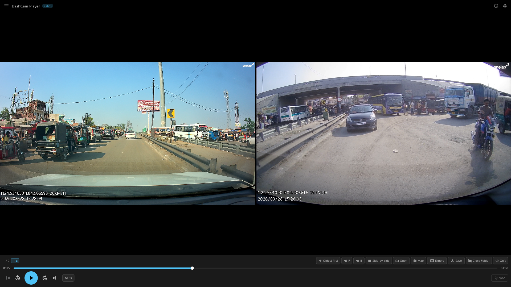
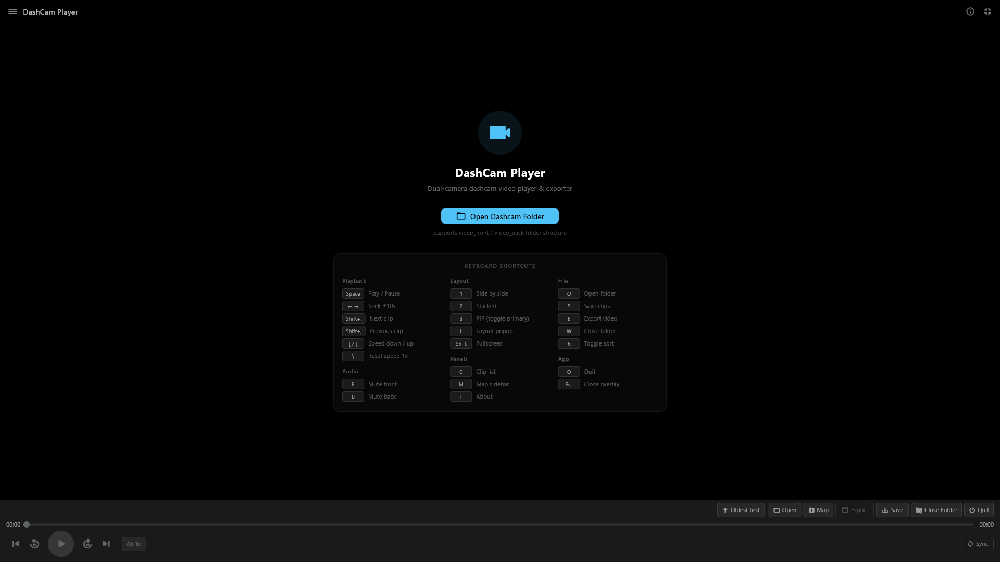
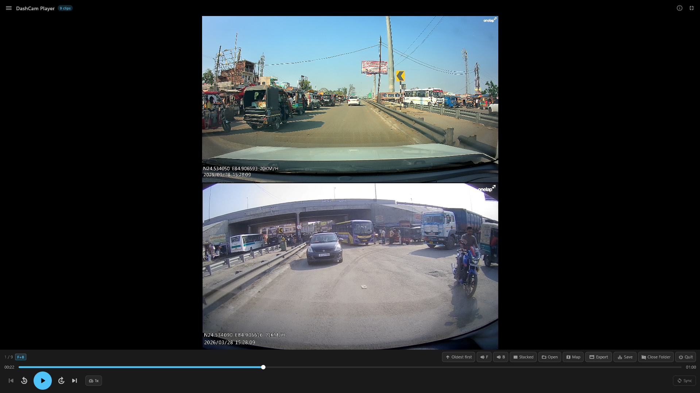
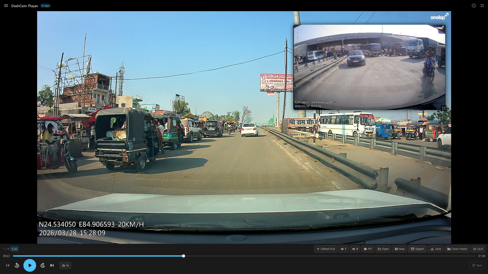
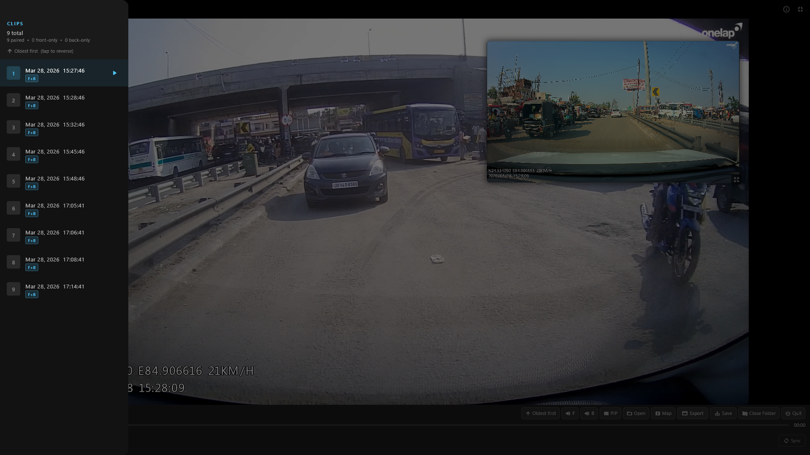
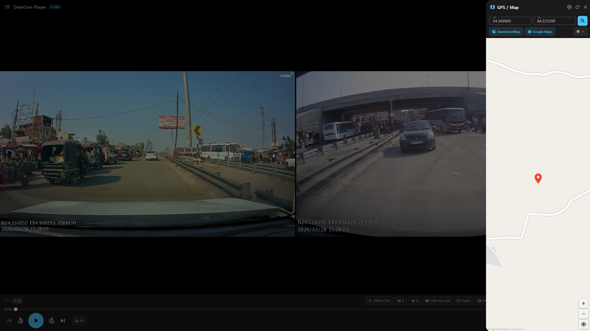

# [DashCam Player](https://santos-k.github.io/Dashcam-Video-Player/)

A powerful Flutter desktop app that plays paired dashcam front/back videos side by side with synchronized controls, variable speed playback, GPS map integration, customizable keyboard shortcuts, Wi-Fi dashcam connectivity, and FFmpeg-powered video export.

**Live site:** https://santos-k.github.io/Dashcam-Video-Player/



---

## Screenshots

| View | Screenshot |
|---|---|
| **Welcome Screen** -- Clean landing page with 3-column shortcut reference |  |
| **Side by Side** -- Front and back cameras playing in perfect sync |  |
| **Stacked Layout** -- Front on top, back below for wide monitors |  |
| **Picture-in-Picture** -- Draggable PIP overlay with GPS coordinates |  |
| **Clip Browser** -- Sortable drawer with thumbnails and pairing badges |  |
| **GPS Map** -- Interactive OpenStreetMap sidebar with coordinate search |  |
| **Map + Playback** -- Review footage alongside GPS position |  |

---

## Features

### Playback & Layout
| Feature | Details |
|---|---|
| Dual video playback | Front + back cameras synced side by side |
| Auto file pairing | Matches by timestamp (+/-5s tolerance) from video_front/video_back folders or F/B filename suffixes |
| 3 layout modes | Side-by-side, Stacked, Picture-in-Picture (key 1/2/3) |
| PIP controls | Draggable, resizable overlay with proportional repositioning on window resize |
| Variable speed | 11 levels from 0.1x to 5x. Speed persists across clips |
| Sync offset | +/-5000ms slider to compensate for recording start differences |
| GPS & Map | Interactive OpenStreetMap sidebar with device location, tile layers, Google Maps link |

### Clip Management
| Feature | Details |
|---|---|
| Thumbnail clip browser | Grid and list views with video thumbnails, auto-scroll to current clip |
| Multi-select | Select mode (X), select all (A), with batch save and delete |
| Delete clips | Remove files from disk with confirmation (single or batch) |
| Batch save | Copy selected clips with real-time progress counter |
| Sort toggle | Oldest-first / newest-first with instant reorder |

### Wi-Fi Dashcam Connection
| Feature | Details |
|---|---|
| Auto-discovery | Scans common IPs and network gateways to find the dashcam |
| File browser | Browse, download, and delete files on the dashcam over Wi-Fi |
| Live stream | RTSP live view with multiple URL presets |
| Camera control | Start/stop recording, take photos remotely |
| Device settings | Resolution, WDR, audio, G-sensor, loop recording, date sync |
| Storage info | Real-time SD card usage bar with free space indicator |
| Heartbeat | Automatic keep-alive to maintain Wi-Fi connection |

### Export & Output
| Feature | Details |
|---|---|
| FFmpeg export | Export composed videos in any layout with H.264 encoding |
| Batch export | Export multiple clips with progress tracking |
| Audio control | Independent front/back mute (F/B keys) |

### Customization
| Feature | Details |
|---|---|
| 30+ shortcuts | Full keyboard-first workflow, all remappable |
| Shortcut editor | Visual dialog to rebind any shortcut with conflict detection |
| Persistent config | Shortcut bindings saved to `shortcuts.json` across sessions |
| Dynamic tooltips | All buttons show current shortcut bindings on hover |
| Smart UI | Auto-hide controls after 5s, video fills full screen |

---

## Keyboard Shortcuts

All shortcuts are customizable via the keyboard icon in the top bar or by pressing `/`.

### Playback
| Key | Action |
|---|---|
| `Space` | Play / Pause |
| `<- ->` | Seek +/-10 seconds |
| `Shift+.` | Next clip |
| `Shift+,` | Previous clip |
| `[ ]` | Decrease / increase speed |
| `\` | Reset speed to 1x |

### Layout & View
| Key | Action |
|---|---|
| `1` | Side by side |
| `2` | Stacked |
| `3` | PIP (toggle primary camera) |
| `L` | Layout popup |
| `Shift` | Toggle fullscreen |

### Panels & Clip Management
| Key | Action |
|---|---|
| `C` | Toggle clip list |
| `T` | Toggle list / thumbnail view |
| `X` | Toggle select mode |
| `A` | Select all / deselect all |
| `M` | Toggle map sidebar |
| `I` | Toggle about |
| `/` | Keyboard shortcuts dialog |
| `Esc` | Close overlay / exit select mode |

### Audio
| Key | Action |
|---|---|
| `F` | Mute front (or single camera) |
| `B` | Mute back camera |

### File Operations
| Key | Action |
|---|---|
| `O` | Open dashcam folder |
| `S` | Save clips to folder |
| `D` | Delete clips |
| `E` | Export composed video |
| `W` | Close folder |
| `R` | Toggle sort order |
| `Q` | Quit application |

---

## Project Structure

```
lib/
  main.dart                          App entry point
  models/
    video_pair.dart                  VideoPair data class
    layout_config.dart               Layout enums & config
    shortcut_action.dart             Shortcut actions, key bindings, defaults
    dashcam_file.dart                Dashcam file model with XML/HTML parsing
    dashcam_state.dart               Dashcam connection & device state
  providers/
    app_providers.dart               All Riverpod providers & notifiers
    dashcam_providers.dart           Dashcam Wi-Fi connection state
  utils/
    file_pairer.dart                 F/B file matching logic
  services/
    export_service.dart              FFmpeg export (side-by-side / stacked / PIP)
    log_service.dart                 File-based logging with daily rollover
    thumbnail_service.dart           FFmpeg thumbnail generation with cache
    shortcut_service.dart            Shortcut config JSON persistence
    dashcam_service.dart             Dashcam HTTP API client (CARDV protocol)
    dashcam_tcp_service.dart         Dashcam TCP socket protocol client
    update_service.dart              GitHub-based auto-update checker
  screens/
    player_screen.dart               Main screen with keyboard shortcuts
  widgets/
    dual_video_view.dart             Dual video renderer with PIP
    playback_controls.dart           Transport bar, speed, sync, export
    layout_selector.dart             Layout & PIP options popup
    clip_list_drawer.dart            Clip drawer with thumbnails & selection
    map_dialog.dart                  OpenStreetMap sidebar with GPS
    shortcut_settings_dialog.dart    Shortcut remapping UI
    dashcam_overlay.dart             Dashcam Wi-Fi connection overlay
    dashcam_file_browser.dart        Remote file browser with download
    dashcam_live_view.dart           RTSP live stream & camera controls
```

---

## Getting Started

### Requirements

- **Windows 10+** (64-bit x64)
- **Flutter SDK** 3.0+ ([install](https://docs.flutter.dev/get-started/install))
- **Visual Studio 2022** with "Desktop development with C++" workload
- **FFmpeg** on PATH (optional, for video export only -- [download](https://ffmpeg.org/download.html))

### Run from Source

```bash
flutter pub get
flutter run -d windows
```

### Build Release

```bash
flutter build windows --release
```

Output: `build/windows/x64/runner/Release/`

### Windows Installer

Build the installer with [InnoSetup](https://jrsoftware.org/isinfo.php) using `installer.iss`.

---

## Dashcam File Structure

The app supports two folder layouts:

**Separate directories** (preferred):
```
SD_Card/
  video_front/          Normal front clips
  video_back/           Normal back clips
  video_front_lock/     Protected front clips
  video_back_lock/      Protected back clips
```

**Single directory with suffixes:**
```
Folder/
  20240315_143022F.mp4    Front camera
  20240315_143022B.mp4    Back camera
```

Supported formats: `.mp4`, `.ts`, `.avi`, `.mkv`

---

## Wi-Fi Dashcam Connection

Connect to your dashcam's Wi-Fi hotspot and browse/download/delete files remotely.

1. Turn on your dashcam and enable Wi-Fi
2. Connect your PC to the dashcam Wi-Fi network
3. Click the Wi-Fi icon in the top bar
4. Click Connect (auto-discovers the dashcam IP)
5. Browse files, stream live video, or manage settings

Supports Novatek CARDV-based dashcams (Onelap, Viofo, and similar).

---

## Tech Stack

- **Flutter 3.0+** -- Cross-platform desktop UI
- **media_kit** -- Video playback (replaces deprecated video_player)
- **flutter_riverpod** -- Reactive state management
- **flutter_map** + **latlong2** -- Interactive OpenStreetMap
- **window_manager** -- Desktop window control
- **FFmpeg** -- Video composition & export (system CLI)

---

## Version History

| Version | Highlights |
|---|---|
| 3.1.0 | Auto-update checker (GitHub releases + main branch detection), drag & drop / file picker / Open With support, live GPS tracking synced to playback, auto-sync paired videos via GPS timestamps, front/back only layout modes, zoom controls, inline map panel, redesigned playlist & clip list UI |
| 2.0.0 | Wi-Fi dashcam connection (browse/download/delete/stream/settings), thumbnail clip browser with grid/list views, multi-select with batch delete, customizable keyboard shortcuts with persistence, PIP position fix on controls toggle, auto-scroll clip list |
| 1.2.0 | Variable speed (0.1x-5x), redesigned landing page, auto-hide controls, save progress, toggle shortcuts, PIP primary swap, instant quit |
| 1.1.1 | PIP bounds fix, shortcuts overhaul, export improvements, About popup |
| 1.1.0 | Interactive map sidebar, ref-after-dispose fix |
| 1.0.0 | Initial release: dual playback, sync, export, PIP |
